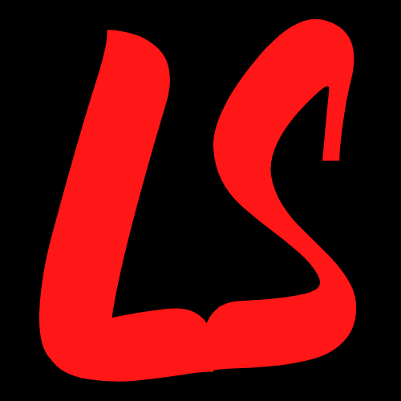

# ULOSTYLE

    

_Adalah css framework karya anak bangsa 99% dengan bahasa Indonesia_   

                                                                                 
                             ulostyle framework                                  
                               Version 0.0.1                                     
                   https://github.com/henryust12/ulostyle                        
                       Licensed under MIT Open Source                            

## Fitur

- Nama kelas 99% dalam bahasa Indonesia
- Mudah digunakan.
- Responsif
- Komponen siap pakai

## Lisensi

MIT
